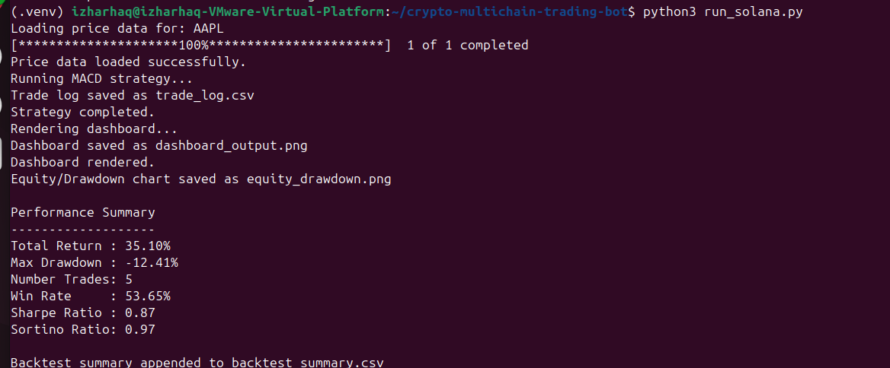
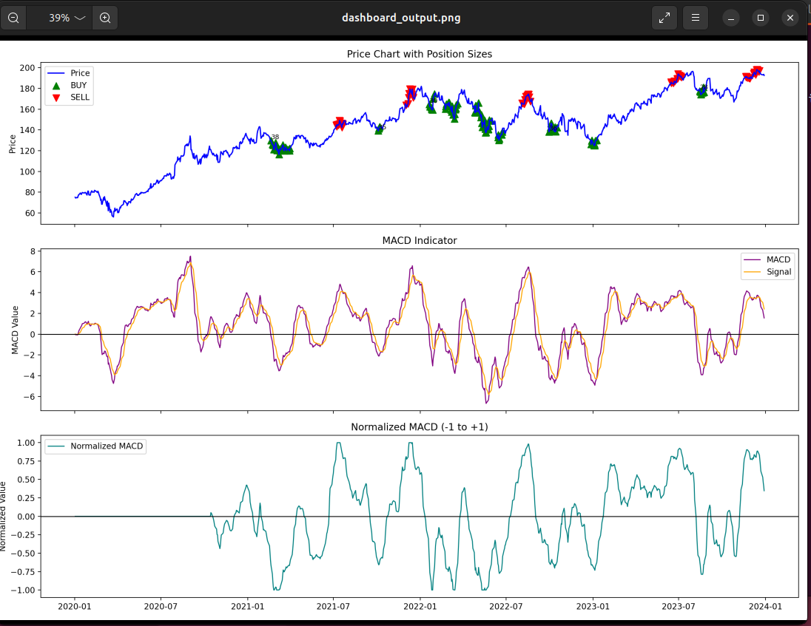
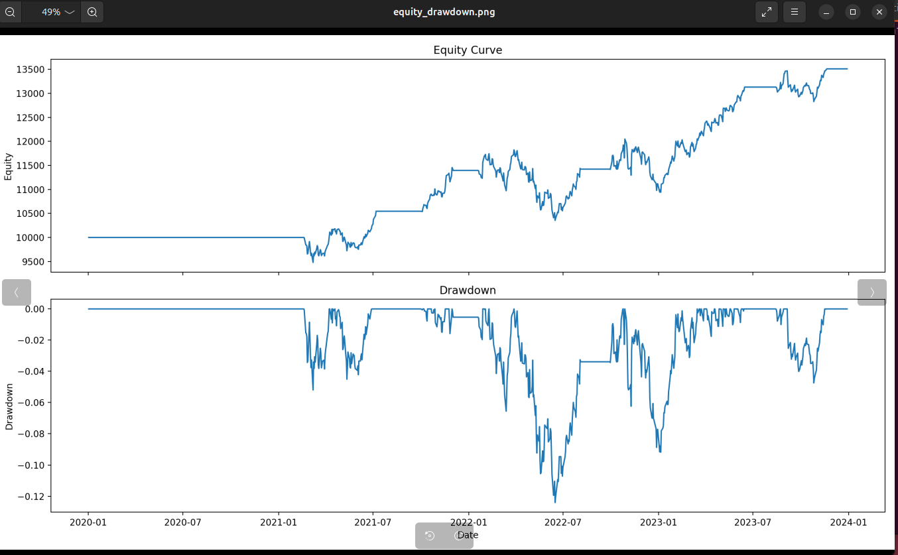
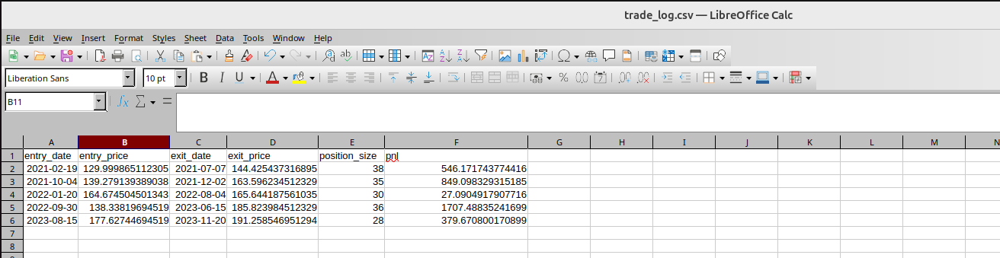
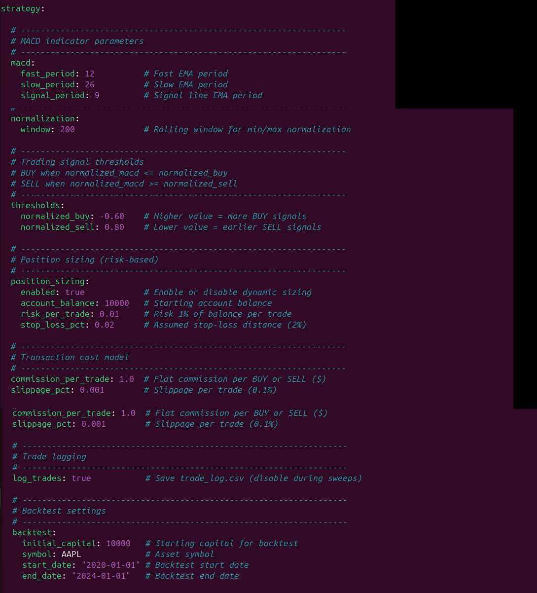

# Crypto Multichain Trading Bot


---

## Description

Crypto Multichain Trading Bot is a modular software project designed to support automated trading workflows across multiple blockchain networks.  
The system emphasizes explicit configuration, predictable execution flow, and clear separation between strategy logic and transaction handling.

This repository provides a structured engineering foundation that can be extended with additional strategies, integrations, and monitoring capabilities.

---

## Table of Contents

- [Screenshots](#screenshots)
- [Prerequisites](#prerequisites)
- [Installation](#installation)
- [Configuration](#configuration)
- [Usage](#usage)
- [Architecture Overview](#architecture-overview)
- [Project Structure](#project-structure)
- [Notes and Limitations](#notes-and-limitations)
- [License](#license)

---

## Screenshots

The following screenshots illustrate key aspects of the system, including execution flow, outputs, and configuration.

### Strategy Execution
Shows a complete strategy run, including data loading, indicator execution, and performance summary.


#### Dashboard Output
Visual dashboard generated after strategy execution, summarizing results and indicators.


#### Equity and Drawdown
Equity curve and drawdown visualization generated from the backtest.


#### Trade Log
Tabular view of executed trades captured during the run.


#### Strategy Configuration
Combined view of strategy parameters, thresholds, risk settings, and backtest configuration.



```text
docs/screenshots/
├── startup.png
├── strategy_execution.png
├── trade_log.png
└── system_flow.png
```
---

## Prerequisites

Python 3.9 or later
Virtual environment support (venv)
Access to blockchain RPC endpoints or exchange APIs (test environments recommended)

---

## Installation

Clone the repository:
git clone https://github.com/IzharHaq1986/crypto-multichain-trading-bot.git
cd crypto-multichain-trading-bot

Create and activate a virtual environment:
python -m venv venv
source venv/bin/activate

Install dependencies:
pip install -r requirements.txt

---

## Configuration

Configuration files are located in the config/ directory.
Strategy parameters, network settings, and execution options are defined explicitly.
Sensitive values such as API keys or private keys must be provided through environment variables.
Review all configuration values before running the application.

---

## Usage

Start the application using the main entry point:
python main.py

Before execution, ensure:
Configuration files are valid
Required environment variables are set
Testing is performed in a non-production environment

---

## Architecture Overview

The system is organized into clear functional layers:

- **Strategy Layer**: Implements trading logic and decision rules.
- **Execution Layer**: Manages order placement and transaction lifecycle.
- **Adapter Layer**: Abstracts blockchain networks and exchange-specific behavior.
- **Configuration Layer**: Centralizes runtime parameters and environment settings.
- **Logging and Monitoring**: Records system behavior, decisions, and execution outcomes.

High-level flow: strategy evaluation → execution → confirmation → logging.

---

## Project Structure
```text
.
├── strategies/          # Trading strategy implementations
├── execution/           # Order execution and transaction handling
├── adapters/            # Blockchain and exchange integrations
├── config/              # Configuration files
├── utils/               # Shared utilities
├── docs/
│   └── screenshots/     # Runtime screenshots
├── requirements.txt     # Dependency list
└── README.md
```
---

### Notes and Limitations

This project provides a technical framework, not a turnkey trading solution.
No financial guarantees are implied.
Users are responsible for compliance, risk management, and secure credential handling.

---

## License

This project is licensed under the MIT License.
See the LICENSE file for details.
